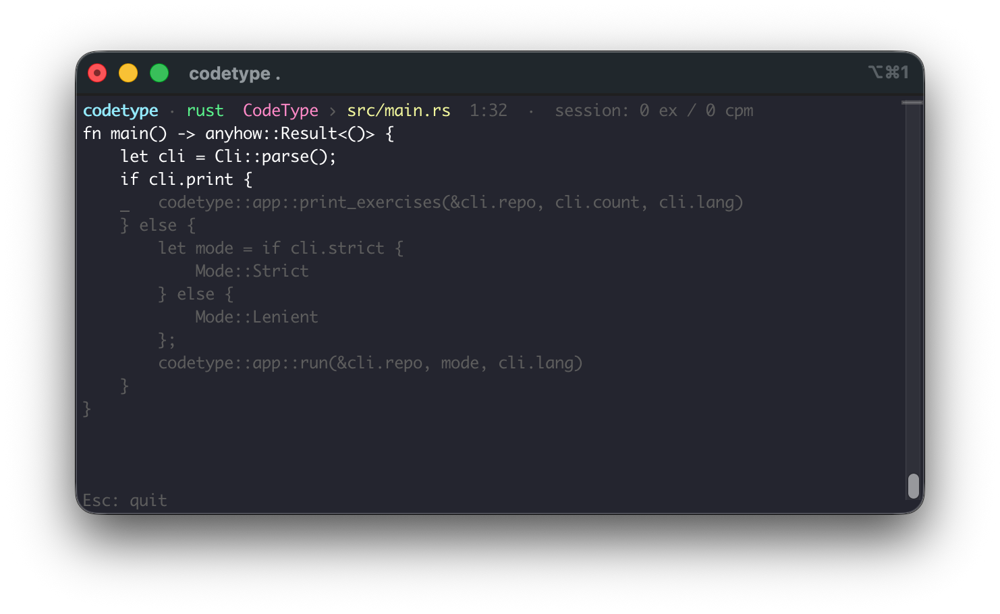

# CodeType

**A terminal typing trainer that drills the real code from your own repo.**

CodeType is a terminal typing trainer (TUI). It parses the source files in a
local Git repository with [tree-sitter](https://tree-sitter.github.io/), pulls
out real functions and type definitions, and has you type them. You practice on
the code you actually write.



## Why

Most typing trainers give you lorem ipsum or generic snippets. The code you
type all day looks nothing like that: your project's identifiers, your
language's punctuation soup. CodeType pulls its exercises from the repo you
point it at, so you drill the keystrokes you'll actually use.

## Features

- Generates exercises from real source files via tree-sitter parsing.
- Auto-detects the dominant language in a repository.
- Two practice modes: **lenient** (Monkeytype-style) and **strict**.
- A distraction-free terminal UI built with [ratatui](https://ratatui.rs/)
  and [crossterm](https://github.com/crossterm-rs/crossterm).
- Single static binary, no runtime dependencies beyond `git`.
- Debug `--print` mode to inspect extracted exercises.

## Supported languages

| Language   | Extensions | `--lang` value          |
| ---------- | ---------- | ----------------------- |
| Swift      | `.swift`   | `swift`                 |
| Rust       | `.rs`      | `rust` (alias `rs`)     |
| TypeScript | `.ts`      | `typescript` (alias `ts`) |

## Install

Clone the repository, then install the binary with Cargo:

```bash
git clone https://github.com/LucaKaufmann/codetype.git
cd codetype
cargo install --path .
```

This builds and installs the `codetype` binary into your Cargo bin directory
(typically `~/.cargo/bin`).

## Usage

```
codetype <path-to-repo> [--lang <lang>] [--strict]
```

**Auto-detect the language** (infers the dominant language from the repo's
tracked files):

```bash
codetype ~/path/to/repo
```

**Override the language** with `--lang` (accepts `swift`, `rust`/`rs`,
`typescript`/`ts`):

```bash
codetype ~/path/to/repo --lang rust
codetype ~/path/to/repo --lang ts
```

**Strict mode**, where wrong keystrokes don't advance the cursor:

```bash
codetype ~/path/to/repo --strict
```

**Print mode**, to dump the extracted exercises to stdout and exit (no TUI).
Handy for debugging extraction. Limit how many with `--count` (default 5):

```bash
codetype ~/path/to/repo --print
codetype ~/path/to/repo --print --count 10
```

## Modes

- **Lenient** (default). Monkeytype-style: a wrong key still advances the
  cursor and is marked as an error, and you press <kbd>Backspace</kbd> to
  correct it. Good for flow and raw speed.
- **Strict** (`--strict`). The cursor only moves when you type the expected
  key, so you can't get ahead of yourself. This is the mode for drilling
  precision.

## Keybindings

| Key            | Action                                   |
| -------------- | ---------------------------------------- |
| <kbd>Esc</kbd> | Quit (works on every screen)             |
| <kbd>n</kbd>   | Next exercise                            |
| <kbd>r</kbd>   | Retry the current exercise               |
| <kbd>:</kbd>   | Open the command palette                 |
| <kbd>?</kbd>   | Show help                                |
| <kbd>q</kbd>   | Quit (on the stats screen)               |

## Requires a Git repository

CodeType lists source files by running `git ls-files`, so the target directory
**must be a Git repository**. Only Git-*tracked* files are drilled; anything
untracked or ignored is skipped. Point it at a non-Git directory and it reports
an error.

## Roadmap and known limitations

- No `.tsx` yet. Only plain `.ts` TypeScript files are parsed.
- No cross-session progress. Each session is independent; tracking "files you
  haven't drilled before" across runs isn't built yet.
- More languages and smarter exercise selection are on the list.

## Contributing

Contributions are welcome. Open an issue to talk through a change, or send a
pull request. Keep the parsing logic covered by tests where it makes sense.

## License

MIT © Luca Kaufmann
